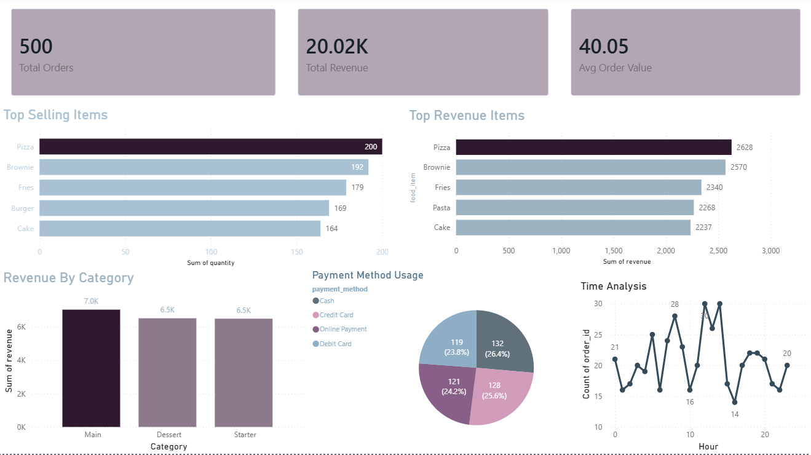

# 🍽️ Restaurant Sales Insights Dashboard

## 🎯 Objective

Analyze restaurant order data to identify sales trends, customer behavior, and key revenue drivers, and provide actionable recommendations for revenue optimization.

---

## 🛠️ Tools Used

* SQL (MySQL) – Data Cleaning & Analysis
* Power BI – Data Visualization & Dashboard

---

## 📁 Dataset

* Source: Kaggle (Restaurant Orders Dataset)
* Total Records: 500 orders
* Type: Synthetic dataset

### Columns:

* order_id
* customer_name
* food_item
* category
* quantity
* price
* payment_method
* order_time
* revenue (derived)

---

## 🧹 Data Cleaning & Preparation

* Standardized column names (removed spaces)
* Converted `order_time` to DATETIME
* Converted `price` to DECIMAL(6,2)
* Checked for NULL values (none found)
* Created derived column: `revenue = quantity × price`

---

## 📊 Exploratory Data Analysis

### 💰 Overall Performance

* Total Orders: 500
* Total Revenue: ₹20,023.14
* Average Order Value: ₹40.05

👉 Business operates on **high-volume, low-value transactions**

---

### 🍕 Product Performance

#### Top Selling Items (by Quantity)

* Pizza (200)
* Brownie (192)
* Fries (179)
* Burger (169)
* Cake (164)

#### Top Revenue Items

* Pizza (₹2627.89)
* Brownie (₹2570.19)
* Fries, Pasta, and Cake also contribute significantly

👉 **Pasta generates high revenue despite lower demand → high-value item**

---

### 🧾 Category Analysis

* Main: Highest demand and revenue
* Dessert & Starter: Close performance

👉 Revenue is **evenly distributed across categories**, indicating a balanced menu
👉 **Item-level performance matters more than category-level**

---

### 💳 Payment Method Analysis

* Most Used: Cash (132 orders)
* Highest Revenue: Credit Card (₹5322.98)

👉 Customers using credit cards tend to place **higher-value orders**
👉 Debit cards have the lowest contribution

---

### ⏰ Time-Based Analysis

* Peak Hours: 12 PM – 2 PM
* Lowest Activity: Around 4 PM

👉 Clear **lunch-time demand spike and mid-afternoon slump**

---

## 🔍 Key Insights

* Business is volume-driven with moderate order value
* Pizza is the top-performing item in both demand and revenue
* Brownie shows strong performance across both metrics
* Pasta is a high-value item with strong revenue contribution
* Burger has high demand but lower revenue potential
* Revenue distribution is balanced across categories
* Credit card users contribute higher revenue per order
* Sales peak during lunch hours and decline mid-afternoon

---

## 💼 Business Recommendations

* Introduce combo meals to increase average order value
* Promote high-value items like Pasta through upselling
* Offer discounts during off-peak hours (3–5 PM)
* Encourage credit card usage through targeted offers
* Highlight top-performing items (Pizza, Brownie) in promotions
* Re-evaluate pricing strategies for low-revenue, high-demand items
* Optimize staff allocation based on peak and off-peak hours

---

## 📸 Dashboard Preview

---

## 📌 Key Takeaway

This project demonstrates how SQL-based analysis combined with data visualization can uncover actionable insights to improve business performance and revenue optimization.

